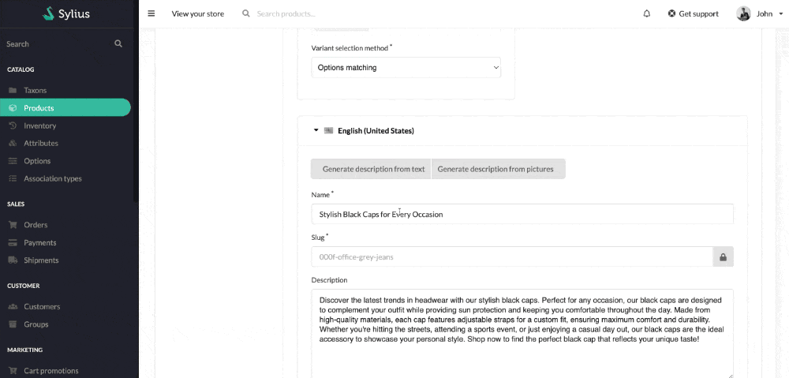

<p align="center">
    <a href="https://www.acseo.fr" target="_blank">
        ACSEO
    </a>
</p>

<h1 align="center">
Sylius AI Tools
<br />
    <a href="https://packagist.org/packages/acseo/sylius-ai-tools" title="License" target="_blank">
        
    </a>
    <a href="https://packagist.org/packages/acseo/sylius-ai-tools" title="Version" target="_blank">
        
    </a>
</h1>


<p>Use AI to improve eShop experience</p>

## Installation


To integrate the **Sylius AI Tools** into your project, follow these steps:

### Step 1: Install the Package

Install **Sylius AI Tools** using Composer. We recommend using stable, supported, and up-to-date versions of packages. Run the following command in your terminal:
```bash
$ composer require acseo/sylius-ai-tools
```

### Step 2: Register the Plugin

You need to register the plugin in your Symfony application. Open the config/bundles.php file and add the following line:
```php
return [
    ACSEO\SyliusAITools\SyliusAITools::class => ['all' => true],
];
```

### Step 3: Import Required Configuration

   Next, import the required configuration by adding the service definitions to your config/packages/_sylius.yaml file. Append the following lines:
```yaml
# config/packages/_sylius.yaml
imports:
    - { resource: "@SyliusAITools/Resources/config/services.yaml" }
```

### Step 4: Import Routing Configuration
To make the routes available, you need to import the routing configuration. Add the following lines to your config/routes.yaml file:

```yaml
# config/routes.yaml
sylius_admin_ai_tools:
    resource: "@SyliusAITools/Resources/config/routes/sylius_admin.yaml"
```

### Step 5: Finalize the Installation
To complete the installation process, clear the cache and update the database schema. Execute the following command:

```bash
$ bin/console cache:clear
```

### Step 6: Configure Twig Paths
Update your Twig configuration to include the plugin's view templates. In your config/packages/twig.yaml, add the following path configuration:
```bash
twig:
    paths:
        '%kernel.project_dir%/vendor/acseo/sylius-ai-tools/src/Resources/views': ~
```

### Step 7: Add Plugin Templates
Copy the plugin templates into your project's template directory. Run the following command:
```bash
cp -R vendor/acseo/sylius-ai-tools/src/Resources/views/bundles/ templates/bundles/
```

### Step 8: Configure the Environment
Finally, set up your environment by adding the OpenAI API key to your .env file. Open the file and add the following line:
```bash
OPENAI_API_KEY=your_api_key_here
```

### Channel Configuration in the Back-Office (BO)

When configuring the channel in the back-office (BO), it is necessary to add:
- **Host**: Specify the required address or domain for the proper functioning of the channel.
- **Locales**: Add the languages supported or used by the channel.

Ensure these settings are correctly configured for optimal channel integration.

## Commands

### `acseo:generate-product-descriptions`
This command generates and updates product descriptions for all products in the system, using provided text and optional keywords.

#### Usage

##### Options:
- **--locale=<locale>**: The locale to use for generating descriptions. The default locale is en (English).
- **--text=<text>**: The text to be used for generating descriptions. This will be processed to create a description for each product.
- **--keywords=<keywords>**: A comma-separated list of keywords that will be used to improve the description generation. For example: --keywords="keyword1, keyword2".

##### Example

```bash
php bin/console acseo:generate-product-descriptions --locale=en --text="Example product description" --keywords="shirt, cotton, casual"
```

This will generate descriptions for all products in the system, using the provided text and keywords.

### acseo:generate-product-descriptions-from-pictures
This command generates and updates product descriptions for all products in the system, using provided pictures (URLs or file paths) and optional keywords.

#### Usage

##### Options:
- **--locale=<locale>**: The locale to use for generating descriptions. The default locale is en (English).
- **--pictures=<pictures>**: A comma-separated list of picture URLs or file paths that will be used to generate descriptions. Each image will be processed to derive relevant information for the descriptions.
- **--keywords=<keywords>**: A comma-separated list of keywords to enhance the description generation. For example: --keywords="keyword1, keyword2".

##### Example

```bash
php bin/console acseo:generate-product-descriptions-from-pictures --locale=fr --pictures="http://example.com/image1.jpg,http://example.com/image2.jpg" --keywords="dress, summer, casual"
```

This will generate descriptions for all products in the system, based on the provided images and keywords.

